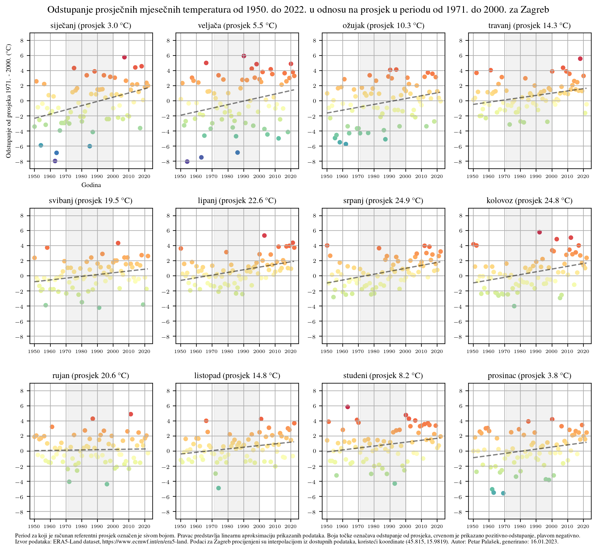

# Plot monthy average temperatures in Čakovec, Croatia and Zagreb, Croatia compared to averages from 1971. to 2010.

### Data

- data from https://www.ecmwf.int/en/era5-land
- https://cds.climate.copernicus.eu/cdsapp#!/dataset/reanalysis-era5-land?tab=overview

After making an account on climate.copernicus.eu the data can be fetched using fetch\_data.py

### Čakovec

### Zagreb

